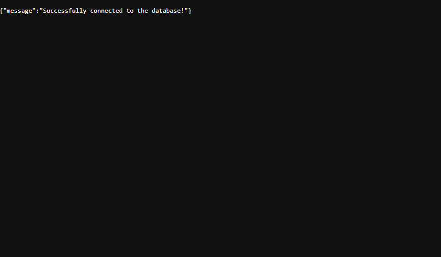

# Lab 13.1: Connecting a Database

[Karl Johnson](https://github.com/hirekarl)  
2025-RTT-30  
<time datetime="2025-08-21">2025-08-21</time>  



## Overview
### Viewer Instructions
1. In the terminal, run:

```bash
cd social-media-api && npm i && node server.js
```

2. In the browser, navigate to http://localhost:3001.

### Submission Source
Main application behavior can be found in [`./social-media-api/server.js`](./social-media-api/server.js).

### Reflection
1. Why is it important to whitelist IP addresses in a real-world production environment? What are the risks of allowing connections from anywhere (`0.0.0.0/0`)?
> We want to restrict database access *only* to authorized entities, and a whitelisting model allows authorization to take place on a refuse-by-default basis. It's important to whitelist authorized IP addresses so entities located at those addresses can interact with the database on those terms. Allowing connections from anywhere with the mask `0.0.0.0/0` defeats the purpose of the refuse-by-default model; any benefits of security that come from restricting access by IP address are voided.

2. What is the purpose of the dotenv package? What other methods could you use to manage environment variables in a production environment (e.g., in a cloud hosting service)?
> The `dotenv` package allows us to keep secrets, like API keys and sensitive configuration settings, decoupled from version control. Instead of declaring and using raw constants and variables in source code, we place them in a `.env` file, which we can then access with `process.env.[ENVVAR_KEY]` once `dotenv` is imported. The `.env` file is ignored by Git by listing it in `.gitignore`, keeping its contents entirely outside of the repository. Most online hosting services have key-value GUI elements where users can store environment variables, which applications can access with the same syntax provided by `dotenv`.

3. If your application failed to connect, what are the first few steps you would take to debug the issue?
> Since I have errors printed to the console, I'd first check my console for any insights. I'd check to be sure my username, password, and connection URI string were correct. If I were working in an environment where only specific IP addresses were whitelisted, I would check to make sure my current IP address matched the corresponding entry in my cluster's Network Access settings. Failing those checks, I'd look at my Atlas dashboard to see if my account had run up against any usage or data limits imposed by my account plan.

## Assignment
You are a backend developer at a startup that is building a new social media platform. Your first major task is to establish the core infrastructure for the application. This involves setting up a production-ready database on MongoDB Atlas and creating a simple Node.js/Express application that can successfully connect to it. This initial setup is critical for all future development on the platform.
